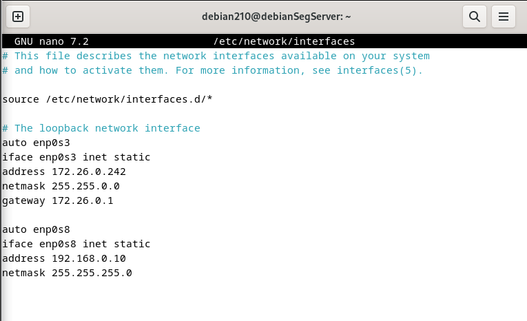
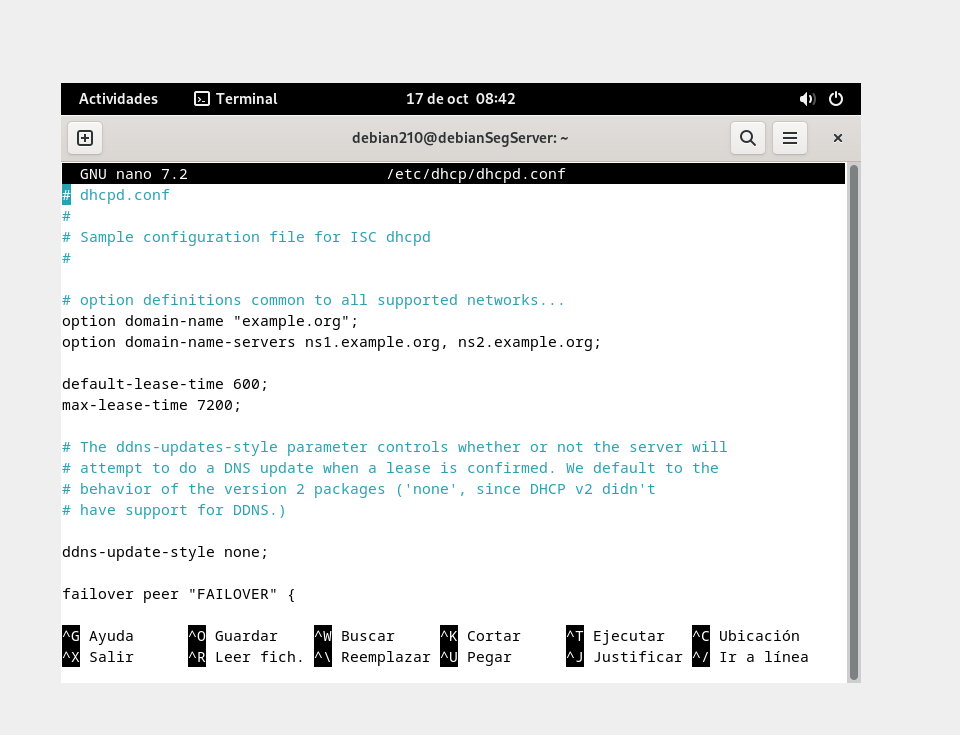
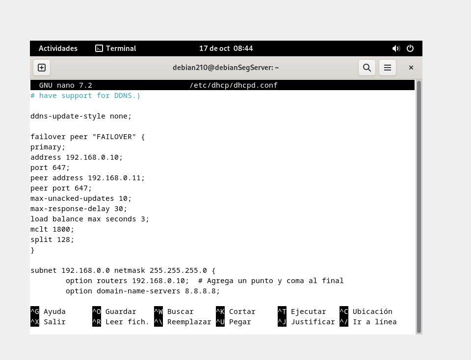
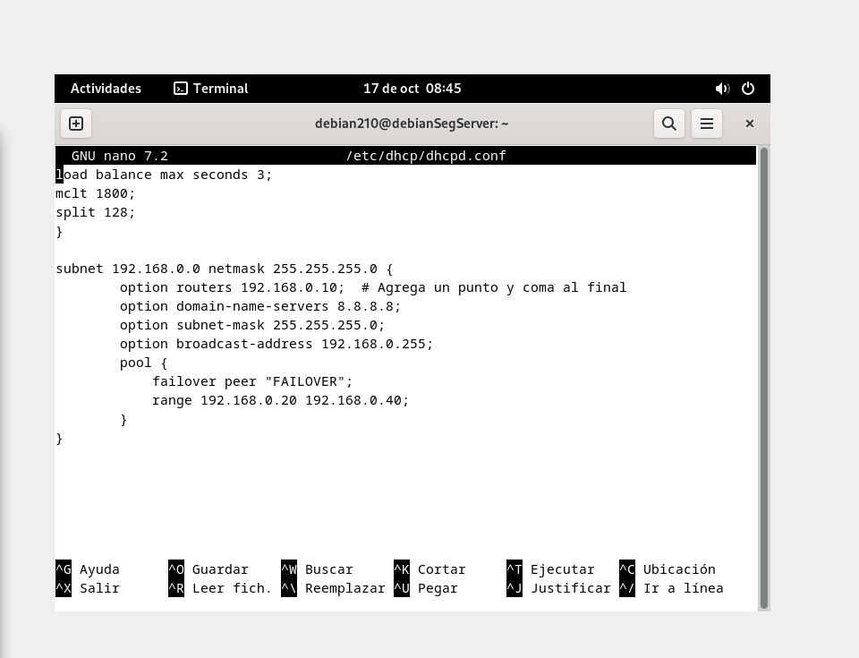

1. Intalmos los repositorios de nuestro debian y hacemos "apt update" y "apt upgrade"
2. Instalamos "isc-dhcp-server"
3. Deshabilitamos el network-manager "apt purgue network-manager"
4. "sudo ip addr flush dev enp0s3" para poner la ip estática
5. ponemos la siguiente configuracion en /etc/network/interfaces

Reestablecemos el servicio cnecesaio con un “systemctl restart networking” y “systemctl restart isc-dhcp-server”
Comprobamos que tenemos acceso a internet desde el servidor haciendo ping a google por ejemplo

